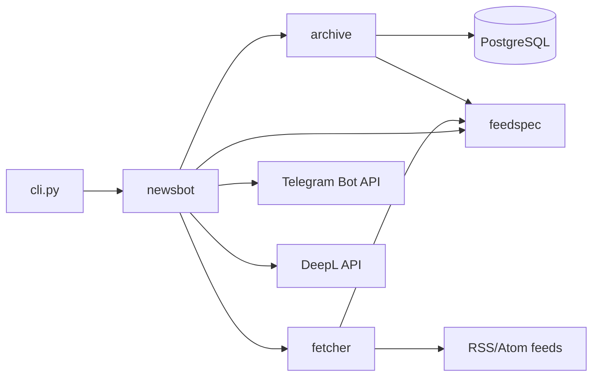
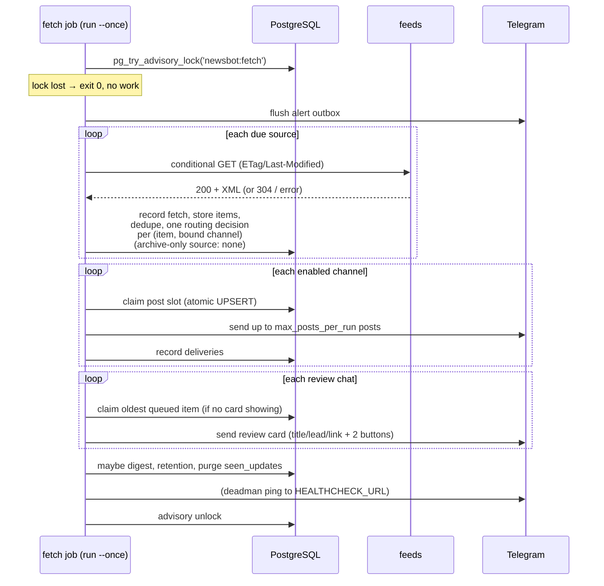
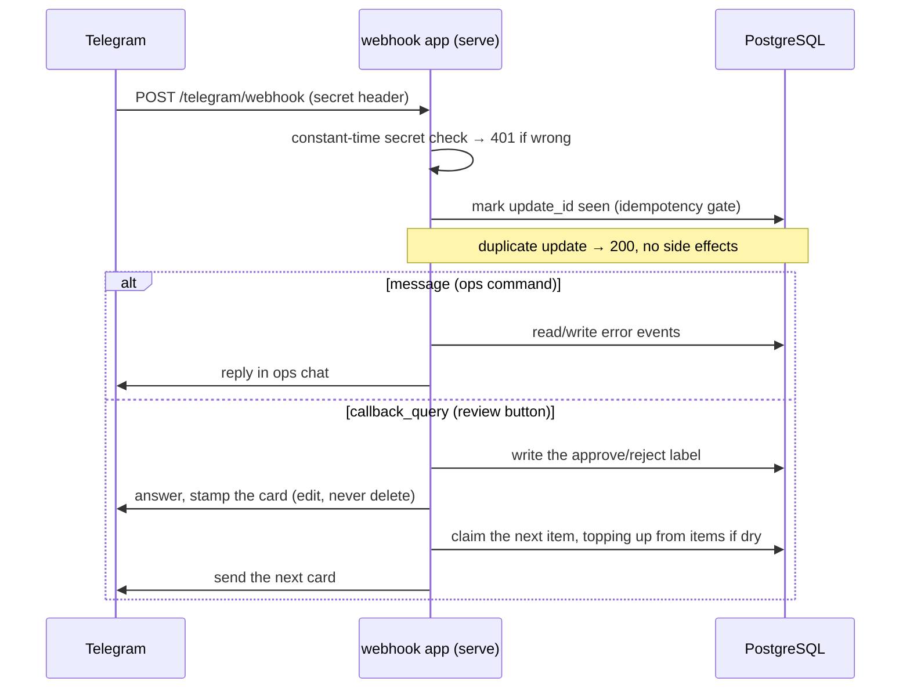

# Architecture

One Python codebase, four packages with a strict dependency direction, one
CLI entrypoint, three runtime shapes.

## Components

| Package | Responsibility | May import |
|---|---|---|
| `feedspec/` | Parse and validate spec bytes; resolve effective config per (source, channel) pair. Pure — no I/O. | nothing internal |
| `specsource.py` | Spec acquisition: `SPEC_JSON` / `SPEC_URL` / `SPEC_PATH` precedence + HTTPS fetch; hands the bytes to `feedspec`. | `feedspec` |
| `fetcher/` | HTTP conditional GET, XML parsing, optional XSD validation, mapping-expression evaluation. **Never imports `archive`** — item-level problems surface through an `on_problem` callback the caller provides. | `feedspec` |
| `archive/` | The only writer to PostgreSQL: items, fetches, decisions, deliveries, error events, feedback reviews, migrations. | `feedspec` |
| `newsbot/` | Orchestration: the runner (fetch → store → route → post), Telegram client, formatter, translation, alert engine, ops-command bot, feedback bot, webhook app. | all of the above |
| `cli.py` | Argument parsing, settings from env, wiring. | all of the above |

## Runtime shapes

The same Docker image runs as three units (locally via docker compose, in
production as Azure Container Apps — see `docs/deployment/azure.md`):

| Unit | Command | Trigger |
|---|---|---|
| fetch job | `python -m cli run --once` | cron, every 5 minutes |
| webhook app | `python -m cli serve` | HTTP, scale-to-zero |
| migrate job | `alembic upgrade head && python -m cli register-webhook` | manual / CI, before each rollout |

## One fetch execution

Key properties:

- **Advisory lock** makes overlapping executions safe: the loser logs
  `fetch_lock_held_elsewhere_skipping` and exits cleanly.
- **Store and decide are one transaction per source**; posting is a separate
  phase with per-post transactions, so a crash mid-posting loses nothing.
- **Dedupe** happens at store time: canonical-URL/content-hash exact match,
  then a simhash scan (Hamming distance ≤ 3) over the last 72 h; duplicates
  are stored anyway with `duplicate_of` set and get `duplicate` decisions.
- **Backlog, not loss**: an item routed while the channel's posting window is
  closed is recorded `rate_limited` with a `gated:` reason and reconsidered
  next window (`drain_all`) or dropped by policy (`drop_oldest`).
- **Storing and posting are separable**: a source with an empty `channels` list
  is [archive-only](configuration.md#archive-only-sources) — it runs the whole
  fetch/parse/dedupe/store path and stops before routing.
- **Reviewing is separable too**: a source with a
  [`feedback`](configuration.md#feedback-sourcesfeedback) chat queues each new
  item for an approve/reject label, independently of whether it posts anywhere.
- Failures are classified into error events and alerted per the spec's
  `errors` config; a failing source backs off exponentially (cap 60 min)
  without affecting other sources.

## The webhook path

`GET /healthz` answers without touching the database — a probe can never
wake Postgres or fail because of it.

The two update kinds diverge before any Bot API call: `getMe` only exists to
disambiguate `/cmd@suffix`, so a button press never pays for it on a cold
start. The label is written before any Telegram traffic, so a card that
cannot be deleted, or a next card that cannot be sent, never costs a
decision — the fetch job repairs the chat on its next pass.

## Spec-driven design

Everything the pipeline does per source/channel comes from the spec
(see `docs/configuration.md`), acquired at startup via `specsource.py` —
`SPEC_JSON` inline, `SPEC_URL` (an HTTPS fetch — what the cloud deployment
uses), or a `SPEC_PATH` file (local development). The spec is content-hashed; every
archived row references the spec version that produced it, so the archive
remains interpretable across config changes.
